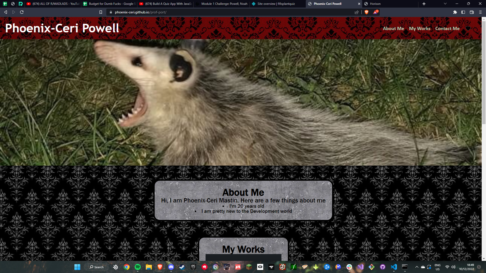

# Module 2 project
## Description
This is a portfolio of my published content and a minor discription of who i am
## Installation
No instalation required

## Usage
https://phoenix-ceri.github.io/prof-port/
To see What i have done and gather a copy of my resume
## Credits

ucf for the base code

## License

used the MIT licence
---
